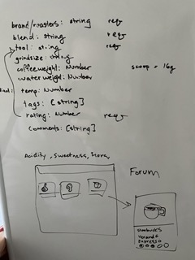

# Coffee-Notes

A tasting and preparation journal for all the coffee loving hobbyist in the world.
 
[Live Coffee-Notes App](https://coffee-notes-journal.herokuapp.com/)
 
Click on the above link to start browsing other peoples brews or start logging your own

## What this is built on

This CRUD app is built on and uses the following

- HTML / EJS
- CSS / BOOTSTRAP
- JAVASCRIPT
- Express
- NODE.JS
- HEROKU
- MONGODB
- Mongoose
- CLOUDINARY

## Brief

Starting with these requirements as a [brief](brief.md).
The idea for Coffee-Notes came about from day to day coffee making and sharing coffee equipment among friends.
The measurements and preparation of the beans all affect the final taste, but writing every description per brew on a note is too much and there was no way to easily share and contribute to these messy notes.
This is for the coffee lovers that want to track and find their ultimate cup of coffee.

## Wireframe

Whiteboard brainstorming
 

## Functionality

On this this app, it features:

1. Community Homepage of all the post
1. Search the Community post to see other user's brews for certain brands or blends
1. Log your own entries
1. Ability view and search through your own entires
1. Update and Delete old post
1. Upload an image with the post
1. User Singup
1. Mobile friendly

## Screenshots

## Future Addition

Additional CSS tweaks
Code Refactoring
